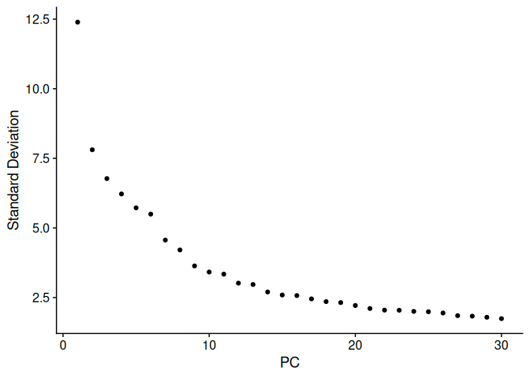

scAGM_preprocess_VEQ
================
Alvaro Regano
2024-08-27

# Objective

This notebook contains the pre-processing of a scRNASeq dataset from
E10.5 Embryos under various conditions. The goal is to produce a dataset
out of the output from cellranger (matrix, feature and cell barcodes)
with which to explore the data and perform various data analysis
approaches (pseudotime, GRN, DEG, fgsea).

The various conditions were introduced on the same 10x port. To
demultiplex them we used HTOs

# Loading matrix data from Cellranger and convert to Seurat object

``` r
scAGM.data <- Read10X(data.dir = "../raw_data/")
```

    ## 10X data contains more than one type and is being returned as a list containing matrices of each type.

``` r
scAGM <- CreateSeuratObject(counts = scAGM.data$`Gene Expression`, 
                                  project = "scAGM_30Sep21", assay = "RNA",
                                  min.cells = 3 , min.features = 200)
scAGM[["HTO"]] <- CreateAssayObject(counts = scAGM.data$`Antibody Capture`[, colnames(x = scAGM)])
rm(scAGM.data)
```

# Perform Dimensionality Reduction and Clustering of the RNA Assay

``` r
DefaultAssay(scAGM) <- "RNA"
DefaultAssay(scAGM)
```

    ## [1] "RNA"

``` r
scAGM <- NormalizeData(scAGM)
```

    ## Normalizing layer: counts

``` r
scAGM <- FindVariableFeatures(scAGM)
```

    ## Finding variable features for layer counts

``` r
scAGM <- ScaleData(scAGM)
```

    ## Centering and scaling data matrix

``` r
scAGM <- RunPCA(scAGM, verbose = FALSE)
scAGM <- FindNeighbors(scAGM, dims = 1:30)
```

    ## Computing nearest neighbor graph

    ## Computing SNN

``` r
scAGM <- FindClusters(scAGM, resolution = 0.8, verbose = FALSE)
scAGM <- RunUMAP(scAGM, dims = 1:30)
```

    ## Warning: The default method for RunUMAP has changed from calling Python UMAP via reticulate to the R-native UWOT using the cosine metric
    ## To use Python UMAP via reticulate, set umap.method to 'umap-learn' and metric to 'correlation'
    ## This message will be shown once per session

    ## 12:23:52 UMAP embedding parameters a = 0.9922 b = 1.112

    ## 12:23:52 Read 23313 rows and found 30 numeric columns

    ## 12:23:52 Using Annoy for neighbor search, n_neighbors = 30

    ## 12:23:52 Building Annoy index with metric = cosine, n_trees = 50

    ## 0%   10   20   30   40   50   60   70   80   90   100%

    ## [----|----|----|----|----|----|----|----|----|----|

    ## **************************************************|
    ## 12:23:55 Writing NN index file to temp file /tmp/RtmpV5TD5o/file23de4bc7edf0
    ## 12:23:55 Searching Annoy index using 1 thread, search_k = 3000
    ## 12:24:01 Annoy recall = 100%
    ## 12:24:02 Commencing smooth kNN distance calibration using 1 thread with target n_neighbors = 30
    ## 12:24:04 Initializing from normalized Laplacian + noise (using RSpectra)
    ## 12:24:04 Commencing optimization for 200 epochs, with 989188 positive edges
    ## 12:24:12 Optimization finished

``` r
DimPlot(scAGM, label = TRUE)
```

<!-- -->
\# HTO demultiplexing

``` r
#  Adding HTO data as an independent assay

scAGM <- NormalizeData(scAGM, assay = "HTO", normalization.method = "CLR")
```

    ## Normalizing across features

``` r
scAGM <- HTODemux(scAGM, assay = "HTO", positive.quantile = 0.99)
```

    ## As of Seurat v5, we recommend using AggregateExpression to perform pseudo-bulk analysis.
    ## This message is displayed once per session.

    ## First group.by variable `ident` starts with a number, appending `g` to ensure valid variable names
    ## Cutoff for HTO303 : 48 reads
    ## 
    ## Cutoff for HTO304 : 8 reads
    ## 
    ## Cutoff for HTO305 : 4 reads
    ## 
    ## Cutoff for HTO306 : 9 reads
    ## 
    ## Cutoff for HTO307 : 23 reads
    ## 
    ## This message is displayed once every 8 hours.

``` r
table(scAGM$HTO_classification.global)
```

    ## 
    ##  Doublet Negative  Singlet 
    ##     2007    10175    11131

``` r
# Group cells based on the max HTO signal
Idents(scAGM) <- "HTO_maxID"
RidgePlot(scAGM, assay = "HTO", features = rownames(scAGM[["HTO"]])[c(1:5)], ncol = 3)
```

    ## Picking joint bandwidth of 0.0656
    ## Picking joint bandwidth of 0.0953
    ## Picking joint bandwidth of 0.0978
    ## Picking joint bandwidth of 0.0492
    ## Picking joint bandwidth of 0.0461

<!-- -->

``` r
FeatureScatter(scAGM, feature1 = "HTO305", feature2 = "HTO307")
```

    ## Warning: Could not find HTO305 in the default search locations, found in 'HTO'
    ## assay instead

    ## Warning: Could not find HTO307 in the default search locations, found in 'HTO'
    ## assay instead

<!-- -->

``` r
Idents(scAGM) <- "HTO_classification.global"
VlnPlot(scAGM, features = "nCount_RNA", pt.size = 0.1, log = TRUE)
```

<!-- -->

HTOs 303, 304 and 305 can be easily segregated

## Subset data removing doublets and negatively labelled cells

``` r
# First, we will remove negative cells from the object
scAGM.subset <- subset(scAGM, idents = "Negative", invert = TRUE)

# Calculate a tSNE embedding of the HTO data
DefaultAssay(scAGM.subset) <- "HTO"
scAGM.subset <- ScaleData(scAGM.subset, features = rownames(scAGM.subset),
                                verbose = FALSE)
scAGM.subset <- RunPCA(scAGM.subset, features = rownames(scAGM.subset), approx = FALSE)
```

    ## Warning: Requested number is larger than the number of available items (5).
    ## Setting to 5.
    ## Warning: Requested number is larger than the number of available items (5).
    ## Setting to 5.
    ## Warning: Requested number is larger than the number of available items (5).
    ## Setting to 5.
    ## Warning: Requested number is larger than the number of available items (5).
    ## Setting to 5.
    ## Warning: Requested number is larger than the number of available items (5).
    ## Setting to 5.

    ## PC_ 1 
    ## Positive:  HTO306, HTO305 
    ## Negative:  HTO303, HTO304 
    ## PC_ 2 
    ## Positive:  HTO305, HTO304 
    ## Negative:  HTO306, HTO303 
    ## PC_ 3 
    ## Positive:  HTO304, HTO307 
    ## Negative:  HTO305, HTO303 
    ## PC_ 4 
    ## Positive:  HTO307, HTO303 
    ## Negative:  HTO304, HTO305 
    ## PC_ 5 
    ## Positive:  HTO306, HTO303 
    ## Negative:  HTO307, HTO304

    ## Warning: Number of dimensions changing from 50 to 5

``` r
scAGM.subset <- RunTSNE(scAGM.subset, dims = 1:3, perplexity = 100, check_duplicates = F)
DimPlot(scAGM.subset, group.by = "hash.ID")
```

<!-- -->

``` r
# To increase the efficiency of plotting, you can subsample cells using the num.cells argument
HTOHeatmap(scAGM, assay = "HTO", ncells = 30000)
```

    ## Warning in HTOHeatmap(scAGM, assay = "HTO", ncells = 30000): ncells (30000) is
    ## larger than the number of cells present in the provided object (23313).
    ## Plotting heatmap for all cells.

    ## Warning: The `<scale>` argument of `guides()` cannot be `FALSE`. Use "none" instead as
    ## of ggplot2 3.3.4.
    ## ℹ The deprecated feature was likely used in the Seurat package.
    ##   Please report the issue at <https://github.com/satijalab/seurat/issues>.
    ## This warning is displayed once every 8 hours.
    ## Call `lifecycle::last_lifecycle_warnings()` to see where this warning was
    ## generated.

<!-- -->

``` r
# Extract the singlets
scAGM.singlet <- subset(scAGM, idents = "Singlet")

table(scAGM.singlet@meta.data$HTO_classification)
```

    ## 
    ## HTO303 HTO304 HTO305 HTO306 HTO307 
    ##   2672   1718   2533   2855   1353

# Redoing Dimensionality Reduction with singlets

``` r
# Select the top 1000 most variable features
scAGM.singlet <- NormalizeData(scAGM.singlet)
```

    ## Normalizing layer: counts

``` r
scAGM.singlet <- FindVariableFeatures(scAGM.singlet, selection.method = "vst")
```

    ## Finding variable features for layer counts

``` r
# Scaling RNA data, we only scale the variable features here for efficiency
scAGM.singlet <- ScaleData(scAGM.singlet, features = VariableFeatures(scAGM.singlet))
```

    ## Centering and scaling data matrix

    ## Warning: Different features in new layer data than already exists for
    ## scale.data

``` r
# Run PCA
scAGM.singlet <- RunPCA(scAGM.singlet, features = VariableFeatures(scAGM.singlet), verbose = F)

# We select the top 10 PCs for clustering and tSNE based on PCElbowPlot
scAGM.singlet <- FindNeighbors(scAGM.singlet, reduction = "pca", dims = 1:10)
```

    ## Computing nearest neighbor graph

    ## Computing SNN

``` r
scAGM.singlet <- FindClusters(scAGM.singlet, resolution = 0.6, verbose = FALSE)
scAGM.singlet <- RunTSNE(scAGM.singlet, reduction = "pca", dims = 1:10)

# Projecting singlet identities on TSNE visualization
DimPlot(scAGM.singlet, group.by = "HTO_classification")
```

<!-- -->

# Quality Control

For the QC I will look at the Feature and Gene counts, as well as the
percentage of mitochondrial and ribosomal genes within each cell

``` r
# QC Analysis
DefaultAssay(scAGM.singlet) <- "RNA"
scAGM.singlet[["percent.mt"]] <- PercentageFeatureSet(scAGM.singlet, pattern = "^mt-")
head(scAGM.singlet@meta.data, 10)
```

    ##                       orig.ident nCount_RNA nFeature_RNA nCount_HTO
    ## AAACCCAAGGCTTTCA-1 scAGM_30Sep21       2796         1640        567
    ## AAACCCACAAGCAGGT-1 scAGM_30Sep21      15847         4428         32
    ## AAACCCACACCTTCGT-1 scAGM_30Sep21      36835         6336         37
    ## AAACCCACAGACGATG-1 scAGM_30Sep21      12372         4236         38
    ## AAACCCACAGTTGGTT-1 scAGM_30Sep21      11466         3723         56
    ## AAACCCACATCCTTGC-1 scAGM_30Sep21       3592         2092        213
    ## AAACCCAGTAATGTGA-1 scAGM_30Sep21      15014         4376        119
    ## AAACCCAGTACAAGCG-1 scAGM_30Sep21       3947         1865       4006
    ## AAACCCAGTGAGACCA-1 scAGM_30Sep21      14116         3879         39
    ## AAACCCAGTGCCTTCT-1 scAGM_30Sep21      23887         5454         45
    ##                    nFeature_HTO RNA_snn_res.0.8 seurat_clusters HTO_maxID
    ## AAACCCAAGGCTTTCA-1            5              10               3    HTO304
    ## AAACCCACAAGCAGGT-1            5               3               0    HTO305
    ## AAACCCACACCTTCGT-1            5               6               6    HTO306
    ## AAACCCACAGACGATG-1            5               8               8    HTO305
    ## AAACCCACAGTTGGTT-1            5               8               8    HTO306
    ## AAACCCACATCCTTGC-1            4              20               7    HTO303
    ## AAACCCAGTAATGTGA-1            4               7               0    HTO306
    ## AAACCCAGTACAAGCG-1            5              19              11    HTO303
    ## AAACCCAGTGAGACCA-1            5               3               0    HTO305
    ## AAACCCAGTGCCTTCT-1            4               1               6    HTO306
    ##                    HTO_secondID HTO_margin HTO_classification
    ## AAACCCAAGGCTTTCA-1       HTO305  4.2763275             HTO304
    ## AAACCCACAAGCAGGT-1       HTO306  0.4283817             HTO305
    ## AAACCCACACCTTCGT-1       HTO304  1.2682372             HTO306
    ## AAACCCACAGACGATG-1       HTO303  0.9641903             HTO305
    ## AAACCCACAGTTGGTT-1       HTO305  1.1266182             HTO306
    ## AAACCCACATCCTTGC-1       HTO307  1.5209592             HTO303
    ## AAACCCAGTAATGTGA-1       HTO304  2.2303322             HTO306
    ## AAACCCAGTACAAGCG-1       HTO304  4.1890073             HTO303
    ## AAACCCAGTGAGACCA-1       HTO304  0.2501711             HTO305
    ## AAACCCAGTGCCTTCT-1       HTO304  0.6874385             HTO306
    ##                    HTO_classification.global hash.ID RNA_snn_res.0.6 percent.mt
    ## AAACCCAAGGCTTTCA-1                   Singlet  HTO304               3   1.216023
    ## AAACCCACAAGCAGGT-1                   Singlet  HTO305               0   3.445447
    ## AAACCCACACCTTCGT-1                   Singlet  HTO306               6   1.778200
    ## AAACCCACAGACGATG-1                   Singlet  HTO305               8   2.634982
    ## AAACCCACAGTTGGTT-1                   Singlet  HTO306               8   2.014652
    ## AAACCCACATCCTTGC-1                   Singlet  HTO303               7  13.335189
    ## AAACCCAGTAATGTGA-1                   Singlet  HTO306               0   3.310244
    ## AAACCCAGTACAAGCG-1                   Singlet  HTO303              11   1.064099
    ## AAACCCAGTGAGACCA-1                   Singlet  HTO305               0   2.351941
    ## AAACCCAGTGCCTTCT-1                   Singlet  HTO306               6   2.750450

``` r
VlnPlot(scAGM.singlet, features = c("nFeature_RNA", "nCount_RNA", "percent.mt"),
        group.by = "orig.ident", ncol = 3, pt.size = 0)
```

<!-- -->

``` r
plot1 <- FeatureScatter(scAGM.singlet, feature1 = "nFeature_RNA",
                        group.by = "orig.ident", feature2 = "percent.mt") +
  geom_vline(xintercept = c(2000,7500),linetype = 2 ) +
  geom_hline(yintercept = 10 ,linetype = 2)
plot2 <- FeatureScatter(scAGM.singlet, feature1 = "nCount_RNA",
                        group.by = "orig.ident",feature2 = "nFeature_RNA")+
  geom_vline(xintercept = c(2000,60000),linetype = 2 )+
  geom_hline(yintercept = c(2000,7500),linetype = 2 )
plot1 / plot2
```

<!-- -->

``` r
nFeature_RNA <- as.data.frame(scAGM.singlet@meta.data$nFeature_RNA)
percent_mt <- as.data.frame(scAGM.singlet@meta.data$percent.mt)

Idents(scAGM.singlet) <- scAGM.singlet@meta.data$hash.ID 

scAGM.singlet <- RenameIdents(scAGM.singlet, 'HTO305' = 'Control VEQ', 'HTO306' = 'NotchLOF VEQ', 'HTO307' = 'Jagged1LOF VEQ', 'HTO303' = 'Odc1_VEQ_Liver', 'HTO304' = 'Odc1_VEQ_Lung')

scAGM.singlet@meta.data$Condition <- scAGM.singlet@active.ident

table(scAGM.singlet@meta.data$Condition)
```

    ## 
    ##    Control VEQ   NotchLOF VEQ Jagged1LOF VEQ Odc1_VEQ_Liver  Odc1_VEQ_Lung 
    ##           2533           2855           1353           2672           1718

``` r
# Ribosomal genes

scAGM.singlet <- PercentageFeatureSet(scAGM.singlet, "^Rp[sl]", col.name = "percent_ribo")

# Hemoglobin genes

scAGM.singlet <- PercentageFeatureSet(scAGM.singlet, "^Hb[^(p)]", col.name = "percent_hb")

# Violin Plots

feats <- c("nFeature_RNA", "nCount_RNA", "percent.mt", "percent_ribo", "percent_hb")
VlnPlot(scAGM.singlet, group.by = "orig.ident", features = feats, pt.size = 0.1, ncol = 3) +
  NoLegend()
```

<!-- -->

``` r
# Clear up the plots

scAGM.singlet <- subset(scAGM.singlet,
                 subset = nFeature_RNA > 2000 & nFeature_RNA < 6000 &
                   nCount_RNA > 2000 & nCount_RNA < 50000  & percent.mt < 10 & percent_ribo < 35 & percent_hb < 1)

scAGM.singlet <- subset(scAGM.singlet,
                        subset = Condition == "Control VEQ" | Condition == "NotchLOF VEQ" | Condition == "Jagged1LOF VEQ")

Idents(scAGM.singlet) <- "hash.ID"

scAGM.singlet <- RenameIdents(scAGM.singlet, 'HTO305' = 'Control VEQ', 'HTO306' = 'NotchLOF VEQ', 'HTO307' = 'Jagged1LOF VEQ')

scAGM.singlet@active.ident -> scAGM.singlet@meta.data$Condition

table(scAGM.singlet@meta.data$Condition)
```

    ## 
    ##    Control VEQ   NotchLOF VEQ Jagged1LOF VEQ 
    ##           2064           2359           1109

After looking at the various plots I set up on removing cells that
contained: less than 2000 or more than 6000 Features (genes) less that
2000 or more than 50,000 Counts (Transcripts) more than 10%
mitochondrial genes more than 35% ribosomal genes more than 1% hemo
genes

## Dimensionality Reduction of cells following demultiplexing and QC

``` r
# Normalize data

scAGM.singlet <- NormalizeData(scAGM.singlet, 
                        normalization.method = "LogNormalize",
                        scale.factor = 10000)
```

    ## Normalizing layer: counts

``` r
# Identification of highly variable features (feature selection)

scAGM.singlet <- FindVariableFeatures(scAGM.singlet, 
                               selection.method = "vst",
                               nfeatures = 2000)
```

    ## Finding variable features for layer counts

``` r
top10 <- head(VariableFeatures(scAGM.singlet), 10)
top10
```

    ##  [1] "Mrc1"   "Col1a1" "C1qb"   "Stfa1"  "Prtn3"  "Ifitm1" "Col1a2" "Col3a1"
    ##  [9] "Postn"  "Lum"

``` r
vars <- VariableFeatures(scAGM.singlet)

vars <- as.data.frame(vars) 

vars %>%  filter(!grepl("^Hb[^(p)]", 1)) %>% filter(!grepl("^mt-", 1)) %>% filter(!grepl("^Rp[sl]", 1)) %>% nrow()
```

    ## [1] 2000

``` r
# There are no mitochondrial, ribosomal or hemmoglobine related genes in the to 2000 variable Features

plot1 <- VariableFeaturePlot(scAGM.singlet)
plot2 <- LabelPoints(plot = plot1, points = top10, repel = TRUE)
```

    ## When using repel, set xnudge and ynudge to 0 for optimal results

``` r
plot2
```

    ## Warning in scale_x_log10(): log-10 transformation introduced infinite values.

<!-- -->

``` r
# Scaling the data

all.genes <- rownames(scAGM.singlet)
# all.genes <- as.data.frame(all.genes)
scAGM.singlet <- ScaleData(scAGM.singlet, features = all.genes)
```

    ## Centering and scaling data matrix

    ## Warning: Different features in new layer data than already exists for
    ## scale.data

``` r
## Perform linear dimensional reduction

scAGM.singlet <- RunPCA(scAGM.singlet,
                 features = VariableFeatures(object = scAGM.singlet), verbose = F)


# Examine and visualize PCA results a few different ways

print(scAGM.singlet[["pca"]], dims = 1:5, nfeatures = 5)
```

    ## PC_ 1 
    ## Positive:  Coro1a, Tyrobp, Fcer1g, Rac2, Spi1 
    ## Negative:  Col4a1, Mest, Emcn, Cald1, Sparc 
    ## PC_ 2 
    ## Positive:  Npm1, Eif5a, H2az1, Ncl, Hspd1 
    ## Negative:  Camk2d, Diaph2, Nrp1, Pcsk5, Sat1 
    ## PC_ 3 
    ## Positive:  Angpt1, Setbp1, Ikzf2, Meis1, Adgrg1 
    ## Negative:  Ccnd1, Ftl1, Marcks, C1qb, C1qc 
    ## PC_ 4 
    ## Positive:  Gja4, Gja5, Hsp90b1, Vwf, Tmem100 
    ## Negative:  Ptprt, 1700007K13Rik, Chrm3, Hs3st4, Ano3 
    ## PC_ 5 
    ## Positive:  Elmo1, Vav3, Mef2c, Fli1, Gab2 
    ## Negative:  Krt8, Col3a1, Hand1, Col1a2, Col1a1

``` r
VizDimLoadings(scAGM.singlet, dims = 1:2, reduction = "pca")
```

<!-- -->

``` r
DimPlot(scAGM.singlet,group.by = "orig.ident", reduction = "pca")
```

<!-- -->

``` r
DimHeatmap(scAGM.singlet, dims = 1:9, cells = 500, balanced = TRUE)
```

<!-- -->

``` r
# Determine the 'dimensionality' of the dataset

ElbowPlot(scAGM.singlet, ndims = 30)
```

<!-- -->

``` r
# Cluster the cells

scAGM.singlet <- FindNeighbors(scAGM.singlet, dims = 1:14)
```

    ## Computing nearest neighbor graph

    ## Computing SNN

``` r
scAGM.singlet <- FindClusters(scAGM.singlet, resolution = 0.1)
```

    ## Modularity Optimizer version 1.3.0 by Ludo Waltman and Nees Jan van Eck
    ## 
    ## Number of nodes: 5532
    ## Number of edges: 167021
    ## 
    ## Running Louvain algorithm...
    ## Maximum modularity in 10 random starts: 0.9391
    ## Number of communities: 4
    ## Elapsed time: 0 seconds

``` r
scAGM.singlet <- FindClusters(scAGM.singlet, resolution = 0.2)
```

    ## Modularity Optimizer version 1.3.0 by Ludo Waltman and Nees Jan van Eck
    ## 
    ## Number of nodes: 5532
    ## Number of edges: 167021
    ## 
    ## Running Louvain algorithm...
    ## Maximum modularity in 10 random starts: 0.9111
    ## Number of communities: 7
    ## Elapsed time: 0 seconds

``` r
scAGM.singlet <- FindClusters(scAGM.singlet, resolution = 0.35)
```

    ## Modularity Optimizer version 1.3.0 by Ludo Waltman and Nees Jan van Eck
    ## 
    ## Number of nodes: 5532
    ## Number of edges: 167021
    ## 
    ## Running Louvain algorithm...
    ## Maximum modularity in 10 random starts: 0.8817
    ## Number of communities: 9
    ## Elapsed time: 0 seconds

``` r
DimPlot(scAGM.singlet)
```

<!-- -->

``` r
#Run UMAP

scAGM.singlet <- RunUMAP(scAGM.singlet, dims = 1:14)
```

    ## 12:26:32 UMAP embedding parameters a = 0.9922 b = 1.112

    ## 12:26:32 Read 5532 rows and found 14 numeric columns

    ## 12:26:32 Using Annoy for neighbor search, n_neighbors = 30

    ## 12:26:32 Building Annoy index with metric = cosine, n_trees = 50

    ## 0%   10   20   30   40   50   60   70   80   90   100%

    ## [----|----|----|----|----|----|----|----|----|----|

    ## **************************************************|
    ## 12:26:32 Writing NN index file to temp file /tmp/RtmpV5TD5o/file23de802455d
    ## 12:26:32 Searching Annoy index using 1 thread, search_k = 3000
    ## 12:26:33 Annoy recall = 100%
    ## 12:26:34 Commencing smooth kNN distance calibration using 1 thread with target n_neighbors = 30
    ## 12:26:36 Initializing from normalized Laplacian + noise (using RSpectra)
    ## 12:26:36 Commencing optimization for 500 epochs, with 212016 positive edges
    ## 12:26:40 Optimization finished

``` r
DimPlot(scAGM.singlet, group.by = "RNA_snn_res.0.35")
```

<!-- -->

``` r
# UMAP

# Load the "scales" package
require(scales)
```

    ## Loading required package: scales

    ## 
    ## Attaching package: 'scales'

    ## The following object is masked from 'package:purrr':
    ## 
    ##     discard

    ## The following object is masked from 'package:readr':
    ## 
    ##     col_factor

``` r
# Create vector with levels of object@ident
identities <- levels(scAGM.singlet@meta.data$RNA_snn_res.0.35)

# Create vector of default ggplot2 colors
my_color_palette <- hue_pal()(length(identities))

DimPlot(scAGM.singlet, label = T)
```

<!-- -->

``` r
p1 <- DimPlot(scAGM.singlet, cols = my_color_palette, pt.size = 1.2, split.by = "Condition", combine = T)

p21 <- p1+
  theme(strip.text.x = element_text(size = 24), plot.title = element_blank())+NoLegend()+xlab("UMAP_1")+ylab("UMAP_2")

p22 <- DimPlot(scAGM.singlet, cols = my_color_palette, pt.size = 1.2)+theme(legend.text = element_text(size = 14), axis.title.x = element_blank(), axis.line.y = element_blank(), axis.text.y = element_blank(), axis.title.y = element_blank(), axis.ticks = element_blank(), plot.title = element_blank())

p23 <- list(p21, p22)

design <- c(patchwork::area(1, 1, 1, 3), patchwork::area(1, 4, 1, 4.5))

p24 <- Reduce( `+`,  p23)+patchwork::plot_layout(design = design)


# cairo_pdf("Plots/QC/UMAP_scAGM30Sep21_Condition_split.pdf",  width = 28, height = 6, family = "Arial")
p24
```

<!-- -->

``` r
# dev.off()


# jpeg("Plots/QC/UMAP_scAGM30Sep21_Condition_split.jpeg", width = 28, height = 6, units = 'in', res = 800)
# p24
# dev.off()
```

# Label Transfer from Zhu et al 2020

``` r
Zhu_dataset <- readRDS("../rds/Zhu_dataset.rds")

scAGM <- scAGM.singlet

RowsNA<-names(which(rowSums(is.na(Zhu_dataset@assays$RNA@counts))>0))

# RowsNA

'%!in%' <- function(x,y)!('%in%'(x,y)) #this is a NOT IN function
RowsKEEP<-rownames(Zhu_dataset)[rownames(Zhu_dataset) %!in% RowsNA]
Zhu_dataset<-subset(Zhu_dataset,features=RowsKEEP)

Zhu_dataset <- NormalizeData(Zhu_dataset, verbose = T)
Zhu_dataset <- FindVariableFeatures(Zhu_dataset, selection.method = "vst", nfeatures = 2000,
                                           verbose = T)

anchors <- FindTransferAnchors(reference = Zhu_dataset,
                               query = scAGM, dims = 1:14)
```

    ## Performing PCA on the provided reference using 1745 features as input.

    ## Projecting cell embeddings

    ## Finding neighborhoods

    ## Finding anchors

    ##  Found 15077 anchors

``` r
# transfer labels
predictions <- TransferData(anchorset = anchors, refdata = Zhu_dataset$Cell_type_refined, dims = 1:14)
```

    ## Finding integration vectors

    ## Finding integration vector weights

    ## Predicting cell labels

``` r
scAGM <- AddMetaData(object = scAGM, metadata = predictions)

scAGM@meta.data$ZhuClustering <- scAGM@meta.data$predicted.id

# saveRDS(scAGM, "rds/scAGM_AllCells.CtrlVEQ.Notch1LOF.Jag1LOF.VEQ.rds")

##########################################################

# Producing a UMAP

Idents(scAGM) <- scAGM@meta.data$ZhuClustering

p1 <- DimPlot(scAGM, pt.size = 1.2, group.by = "ZhuClustering", split.by = "Condition", combine = T)

p21 <- p1+
  # facet_grid(~Condition, labeller = as_labeller(new_labels, default = label_parsed))+
  theme(strip.text.x = element_text(size = 24), plot.title = element_blank())+NoLegend()+xlab("UMAP_1")+ylab("UMAP_2")

p22 <- DimPlot(scAGM, group.by = "ZhuClustering", pt.size = 1.2, label = T, label.box = T, repel = T)+theme(legend.text = element_text(size = 14), axis.title.x = element_blank(), axis.line.y = element_blank(), axis.text.y = element_blank(), axis.title.y = element_blank(), axis.ticks = element_blank(), plot.title = element_blank())

p23 <- list(p21, p22)

table(scAGM@meta.data$Condition)
```

    ## 
    ##    Control VEQ   NotchLOF VEQ Jagged1LOF VEQ 
    ##           2064           2359           1109

``` r
design <- c(patchwork::area(1, 1, 1, 8), patchwork::area(1, 9, 1, 9.5))

p24 <- Reduce( `+`,  p23)+patchwork::plot_layout(design = design)


# cairo_pdf("Plots/scAGM_AllCells/Zhu_et_al/UMAP_ZhuClustering.pdf",  width = 58, height = 6, family = "Arial")
p24
```

<!-- -->

``` r
# dev.off()


# jpeg("Plots/scAGM_AllCells/Zhu_et_al/UMAP_ZhuClustering.jpeg", width = 58, height = 6, units = 'in', res = 400)
# p24
# dev.off()
```

``` r
# Bar Plot Zhu labels

table(scAGM@meta.data$Condition)
```

    ## 
    ##    Control VEQ   NotchLOF VEQ Jagged1LOF VEQ 
    ##           2064           2359           1109

``` r
# Load the "scales" package
require(scales)

scAGM@meta.data$ZhuClustering <- as.factor(scAGM@meta.data$ZhuClustering)

# Create vector with levels of object@ident
identities <- levels(scAGM@meta.data$ZhuClustering)

# Create vector of default ggplot2 colors
my_color_palette <- hue_pal()(length(identities))


p1 <- dittoBarPlot(scAGM, var = "ZhuClustering", group.by = "Condition", 
                   # x.reorder = c(1,3,2,4),
                   color.panel = my_color_palette,
                   xlab = NULL, main = NULL, y.breaks = c(0,0.25,0.5, 0.75, 1), min = 0, max = 1)+
  theme(axis.text=element_text(size=15), axis.title = element_text(size = 18), legend.text = element_text(size = 16), axis.text.x = element_text(angle = 25))+
  # scale_x_discrete(labels=c("Control", bquote(italic(Dll4)^iDEC), bquote(italic(Dll4Het)^iDEC), bquote(italic(DBZ)^iDEC)))+
  geom_col(width = 0.1)+
  # scale_y_discrete(labels=c("0", "25", "50", "75", "100"))
  scale_y_continuous(labels = c("0", "25", "50", "75", "100"))
```

    ## Scale for y is already present.
    ## Adding another scale for y, which will replace the existing scale.

``` r
# cairo_pdf("Plots/Zhu_et_al/BarPlot_ZhuClustering.pdf",  width = 10, height = 6, family = "Arial")
p1
```

<!-- -->

``` r
# dev.off()


# jpeg("Plots/Zhu_et_al/BarPlot_ZhuClustering.jpeg", width = 10, height = 6, units = 'in', res = 800)
# p1
# dev.off()
```

``` r
# VlnPlot with markers

genes <- c("Runx1", "Kit", "Myb", "Ikzf2", "Gfi1", "Tek", "Cdh5", "Myc", "Mycn", "Mfng", "Notch1", "Jag1", "Hey2", "Hey1", "Hes1")

Idents(scAGM) <- "ZhuClustering"


p2 <- VlnPlot(scAGM, features = genes, split.by = "ZhuClustering", stack = T)
```

    ## The default behaviour of split.by has changed.
    ## Separate violin plots are now plotted side-by-side.
    ## To restore the old behaviour of a single split violin,
    ## set split.plot = TRUE.
    ##       
    ## This message will be shown once per session.

``` r
# cairo_pdf("Plots/Zhu_et_al/VlnPlot_Embryo_markers_scAGM_ZhuClustering.pdf",  width = 20, height = 12, family = "Arial")
p2
```

<!-- -->

``` r
# dev.off()

# jpeg("Plots/Zhu_et_al/VlnPlot_Embryo_markers_scAGM_ZhuClustering.jpeg", width = 20, height = 12, units = 'in', res = 800)
# p2
# dev.off()
```
