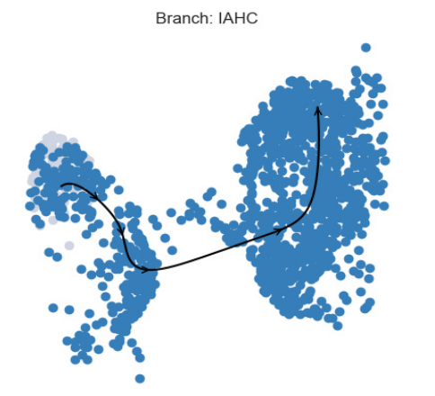

# Pseudotime Analysis with Palantir

Pseudotime was modeled using the Palantir package (https://github.com/dpeerlab/Palantir). Palantir was used onto the dorsal aorta (Arterial ECs, Pre-HE and HE celltypes) and IAHCs celltypes. 

Pseudotime trajectory was executed with aorta ECs as the starting state (highest expression of the Bmx marker) and IAHCs as the terminal state (highest expression of Myc)

